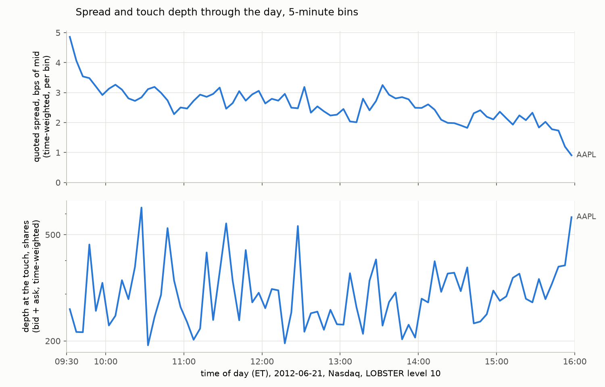
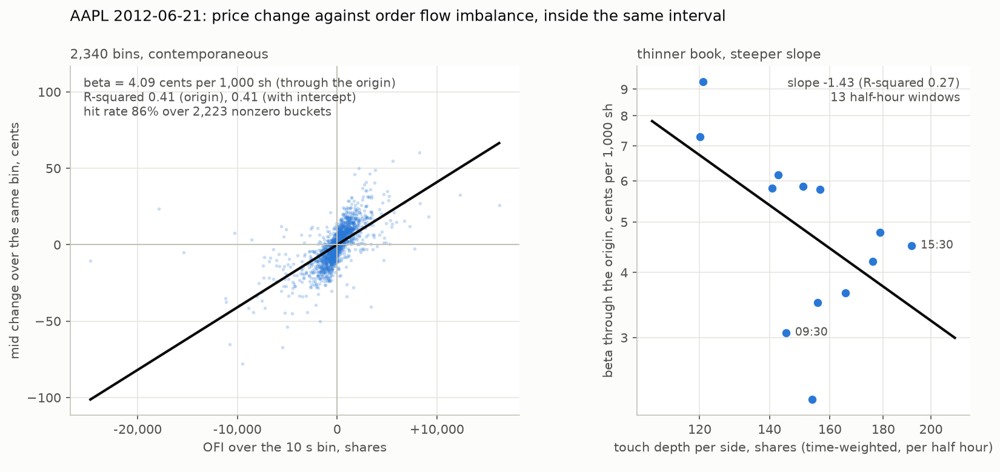
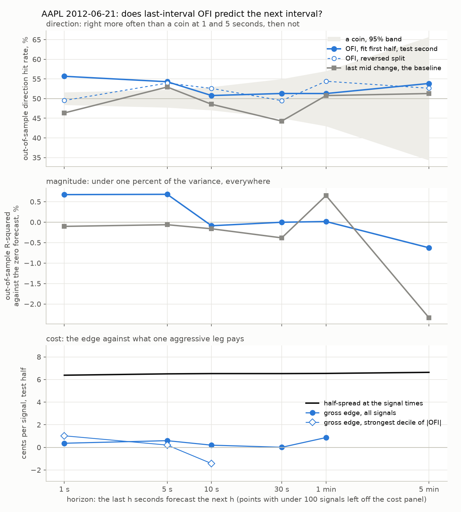

# limit-order-book

Limit order book reconstruction and short-horizon prediction, built to be
verified. A market is a state machine and the feed is its event log. This
project folds exchange messages into the book state they imply, exactly
and reproducibly, and every eventual claim will carry its window and its
trial count.

It is the second project in a sequence. The
[event-driven-backtester](https://github.com/dyjaden/event-driven-backtester)
measured why daily-bar backtests lie (survivorship bias: 5.48 pp/yr,
measured). This one goes a level down, to how prices actually get made.
Its Week 7 audited the backtester's own spread assumption against
measured TAQ data, so the two repos now check each other:
[`results/cross_project_audit.md`](results/cross_project_audit.md).

## Results (measured, not claimed)

One real day so far: AAPL, 2012-06-21, LOBSTER sample data, replayed
message by message and graded against LOBSTER's own published book
states after every single one of 400,390 messages. Zero anomalies,
zero per-order inconsistencies, 68.4% of rows exact at the touch, and
**every divergent row machine-classified into one of four named classes
of the file's own information limit, with zero rows unexplained**. The
headline finding: a level-filtered feed file is provably not a
self-contained event log, and we traced a named order through the exact
mechanism (added in view, deleted below the visible band, resurfacing
as a phantom). Full write-up, tables, and the falsifiable prediction
for the raw-ITCH replay: [`results/lobster_validation.md`](results/lobster_validation.md).

That prediction then went on trial, in two parts. The book was rebuilt
from Nasdaq's binary TotalView-ITCH 5.0 format, and on unfiltered data
the repair machinery must never fire: a full-depth synthetic day
(120,013 messages written by our own ITCH writer and round-tripped
field for field) replays from an empty book with every counter at zero,
including a front-of-queue assertion on all 16,963 executions. Then we
became the filter: our own full-depth ground truth cut to K levels and
fed to the unchanged Week 2 machinery reproduces **all four divergence
classes with zero rows unexplained, and the machinery's dark-liquidity
caseload is predicted exactly from the events the filter hid** (K=3:
2,854 predicted, 2,854 observed; the same at K=1, 5 and 10). The real
ITCH day has not run yet, so the prediction stands on synthetic data
only. Numbers, the filter's measured cost, and the Python throughput
baseline: [`results/itch_baseline.md`](results/itch_baseline.md).

Then the book was measured, time-weighted, from LOBSTER's own exact
top-ten states. AAPL, 2012-06-21, Nasdaq: a quoted spread of 15.1 cents
(2.6 bps) that falls all day rather than tracing a U, to 0.9 bps in the
last five minutes; 308 shares at the touch; a book so sparse that
adjacent occupied levels average 2.5 cents apart and the tenth level is
22 to 24 cents away. Of 191,015 visible orders, 8% traded and 86% were
cancelled, with a Kaplan-Meier median lifetime of 328 ms and 5.3%
censored by the level filter; an order that joined the best got 22.5%
of its shares filled, one resting five cents behind got 6.5%. Three
known-answer checks: the level-1 and level-10 files agree on every
touch statistic **to the integer**; our replayed book's depth is
**low by 7% at the touch and 18% over ten levels** against the
reference, the sign the Day 2 taxonomy predicted wrong, because rows
are not shares; and against the SEC's MIDAS counts for the same name
and day, every predicted relation held (our Nasdaq-only cancel-to-trade
7.4 against 13.3 for all venues, hidden and odd-lot rates within 20%,
Nasdaq's share of lit volume 27.5%). Write-up, four figures, and the
graded list of predictions written before the run:
[`results/microstructure.md`](results/microstructure.md).



Then the signal the project was pointed at: order flow imbalance, as
Cont, Kukanov and Stoikov define it, computed from the touch after
every one of the 400,390 messages, with the sign convention pinned by
sixteen hand-computed tests and the level-1 and level-10 files giving
the same 107,164 nonzero events to the share. Aggregated on two clocks
(ten-second bins hold 0 to 725 best-quote updates; fifty-update
buckets last from 6 ms to 65 s), and then the first look, which is
**contemporaneous and descriptive**: the mid change over a ten-second
bin regressed on the imbalance inside the same bin gives a slope of
4.1 cents per 1,000 shares, an R-squared of 0.41 and a sign hit rate
of 86%, with beta stable across five clocks (3.8 to 4.4) and the
R-squared rising with the interval (0.31 at one second, 0.55 at one
minute); across thirteen half hours the slope scales with depth to the
power -1.43, the paper's inverse-depth law with a short lever. Every
one of those nineteen regressions was a row in `results/trials.csv`
before it was a number on a page, and none of them is evidence of
predictability: the flow and the price move happened together. The
predictive question is Week 6's and is defined in the registry before
it runs. Write-up with the expectations graded:
[`results/ofi_first_look.md`](results/ofi_first_look.md).



Then the question itself, defined in full before it ran: does the
imbalance over the **last** interval say anything about the mid change
over the **next** one? Fit through the origin on the first half of the
day, tested on the second (and the reverse), against the zero forecast
and the last mid change as baselines, at 1, 5, 10, 30 seconds, 1 and 5
minutes, every one of the 58 fits a registry row before it was a
number. **The answer: OFI predicts the next interval's mid change at a
horizon of 5 seconds with a hit rate of 54.3% (plus or minus 2.3
points), and the edge is consumed by half the spread 11 times over,
0.59 cents gross per signal against a half-spread of 6.5 cents.** At one
second the direction is right 55.7% of the time on the afternoon and
49.5% on the morning, so only the five-second result survives the
reversed split; nothing clears a coin's band from ten seconds on; the
out-of-sample R-squared is under 0.7% everywhere; the predictive slope
is an eighth of the contemporaneous one. The one regime where the
ten-second signal clears its band is the quiet decile of trailing
variance (63.6% of 264 calls), and the strongest decile of one-second
signals is right 66% of the time and still 5.6 times short of the
half-spread. Four of the nine expectations written before the run
held and five failed, each failure named. Write-up and tables:
[`results/ofi_prediction.md`](results/ofi_prediction.md).



Then the question of scale, in two directions. Down the liquidity
spectrum first: against the SEC's MIDAS counts for every one of the
4,939 securities trading that day, AAPL is in the top 2% by lit trades
and by cancels, and every name LOBSTER's sample offers (MSFT, INTC,
AMZN, GOOG) is in the top 5%, so the "less liquid" name this project
can reach through LOBSTER is less liquid than AAPL by a factor of three
and a half in trades and the long tail is not reachable that way at
all. The cancel-to-trade expectation failed in direction, because a
ratio with trades in its denominator ranks the thinnest names highest;
the side-by-side of Weeks 4 to 6 has one column until the second
name's files land:
[`results/liquidity_spectrum.md`](results/liquidity_spectrum.md). Then
across the backtester's universe, from the consolidated tape: WRDS TAQ
quotes and trades for fifty S&P 500 names, five from each dollar-volume
decile of CRSP's membership on the day, plus AAPL, with our own
Lee-Ready signing and spread arithmetic pinned by hand. **The median
half effective spread, what a taker paid one way, was 1.7 basis points
of the mid**, 1.1 in the top decile and 2.7 in the bottom (the thinnest
tenth of the index still trades about thirty million dollars a day, so
the 5 to 10 bps written for it failed); the realized spread was negative
for 23 of the 51 names and the median price impact (3.7 bps) exceeded
the median effective spread (3.4), so the provider kept almost nothing
at five minutes; AAPL's NBBO quoted spread was 11.54 cents against the
15.13 Day 4 measured on Nasdaq alone:
[`results/taq_spreads.md`](results/taq_spreads.md). Then the audit the
two repos were pointed at, with the backtester's number read from its
own README rather than remembered. The README reports its spread
"across 1-5 bp", its prose calls the parameter a half-spread, and its
code charges half of it, so the runs labelled 1 bp paid 0.5 bp per
side; against the tape, **1 bp one way is right for the top
dollar-volume decile (median 1.13 bps) and nowhere else, 1.7 times
light for the median name and 2.7 times in the bottom decile, and the
0.5 bp the code charged is 3.4 and 5.5 times light**, which by the
backtester's own sensitivity table is under 0.01 Sharpe at its
turnover: the label is off by more than the result. Twelve registry
rows, two of four pre-written lines held under each reading, the
sentence the backtester's README now cites:
[`results/spread_audit.md`](results/spread_audit.md).

## Status

Week 1 (2 September 2026): the book core, its invariant suite, and a
synthetic message tape, all in Python. The suite caught a real bug
before any data existed: a refused amend was silently sending the
original order to the back of its queue (details in the `Book.replace`
docstring). Week 2 (9 September): LOBSTER replay and the row-by-row
reference validation above, which added `reduce`, the seed, the
dark-liquidity rule, ghost eviction, and the witness rule. Week 3 (9 to
11 September): the ITCH 5.0 parser with hand-built byte fixtures and a
binary fiction writer, the full-depth replayer from an empty book, the
self-filter experiment, and the throughput baseline (parse, replay and
end to end timed separately, medians with spread, machine named).
Week 4 (15 to 23 September): descriptive microstructure, time-weighted
from the reference states: the intraday spread and depth, order
lifecycles with censoring handled by Kaplan-Meier, book shape by
occupied level and by cent, and three known-answer checks (file
against file, replay against reference, and the SEC's MIDAS numbers
for the same day). One name so far; MSFT, the large-tick contrast,
runs through the same scripts when its LOBSTER files land (LOBSTER's
samples now sit behind an academic request rather than a link).
Week 5 (2 to 3 October): order flow imbalance from the touch, the two
clocks, the trial registry (append-only, a number logged before it is
printed), and the contemporaneous first look, graded against the
expectations written before the run and reported as descriptive.
Week 6 (4 October): the honest evaluation, the predictive question
frozen before it ran, six horizons out of sample in both split
directions, five regimes, the cost verdict against the half-spread at
the time, and the sentence with its numbers; 58 more registry rows.
Week 7 (5 to 9 October): the five LOBSTER names placed on the SEC's
spectrum for the day, WRDS TAQ spreads for fifty S&P 500 names plus
AAPL (quoted, effective, realized, by dollar-volume decile), the audit
of the backtester's spread assumption read from its own README and
code, and the cross-project page; 12 more registry rows, 89 in all.
The second LOBSTER name (GOOG and MSFT requested) is still owed and
the compare table says so. **146 tests passing**, CI green on every
push. Next is Week 8, the C++ book, unless the semester bites, in
which case Weeks 8 and 9 are cut and Week 10's robustness sweep over
the registry comes next.

## Design commitments, stated before the results exist

- **Prices are integer ticks.** Float money is how backtests lie by
  fractions of a cent. The tick size is display metadata, never
  arithmetic.
- **This is a reconstruction book, not a matching engine.** It applies an
  exchange's message log; it does not match orders itself. A crossing add
  is refused loudly, because a real feed never delivers one (the exchange
  would have matched it first). Feed corruption becomes noise you hear.
- **Replace loses queue position by construction** (cancel plus re-add),
  because price-time priority says it must, and a rule the structure
  enforces cannot be forgotten by an implementation.
- **Fiction before data.** A synthetic message tape exercises everything
  before any real file is parsed. When a real replay disagrees with a
  reference, the book should not be the suspect.
- **The trial registry exists before the first prediction is attempted.**

## Reproduce

```bash
git clone https://github.com/dyjaden/limit-order-book.git
cd limit-order-book
python -m venv .venv
source .venv/bin/activate            # Windows: .venv\Scripts\Activate.ps1
python -m pip install -e ".[dev]"
python -m pytest -q                  # 146 passed
python scripts/make_fake_tape.py     # 100k synthetic messages, invariants
                                     # checked at every step
python scripts/make_fake_itch.py     # the same fiction as ITCH 5.0 bytes,
                                     # written to data/_fake/fake_itch5.bin
python scripts/replay_itch.py        # full-depth replay from an empty book;
                                     # exits nonzero unless every counter is 0
python scripts/filter_experiment.py  # the self-filter experiment (~10 s)
python scripts/replay_itch.py --bench --write results/itch_baseline.md
```

The Week 4 measurements need the LOBSTER files (below) and matplotlib
(`pip install -e ".[dev,analysis]"`):

```bash
python scripts/intraday_report.py --ticker AAPL    # then --figure
python scripts/lifecycle_report.py --ticker AAPL   # then --figure
python scripts/depth_profile.py --ticker AAPL      # then --figure
python scripts/microstructure_checks.py --ticker AAPL --write results/microstructure.md
```

Week 5, on the same files:

```bash
python scripts/ofi_report.py --ticker AAPL                 # events; --level 1 for the identity
python scripts/ofi_report.py --ticker AAPL --clock calendar --bucket 10
python scripts/ofi_report.py --ticker AAPL --clock event --bucket 50
python scripts/ofi_report.py --ticker AAPL --figure        # the two-clock figure
python scripts/ofi_first_look.py --ticker AAPL --figure    # appends 19 rows to results/trials.csv
```

Week 6, the prediction, in four parts that each log their own trials
(24, 10 and 24 rows); the write-up and figure read the CSVs and add none:

```bash
python scripts/ofi_prediction.py --ticker AAPL --part decay
python scripts/ofi_prediction.py --ticker AAPL --part regimes
python scripts/ofi_prediction.py --ticker AAPL --part cost
python scripts/ofi_prediction.py --ticker AAPL --part writeup --figure
```

Week 7. The spectrum needs the MIDAS quarter file in `data/midas/`
(`results/liquidity_spectrum.md` names it); the TAQ pull needs a WRDS
account on the machine that runs it (`pip install -e ".[dev,analysis,taq]"`,
the password in `.pgpass`), and everything after the pull runs from the
cache with no network; the audit needs the backtester's repo on disk:

```bash
python scripts/liquidity_spectrum.py --part midas      # the five names on the day's universe
python scripts/liquidity_spectrum.py --part compare    # one row until the second name lands
python scripts/taq_spreads.py --date 2012-06-21 --sp500 --per-decile 5 --also AAPL --username <wrds user>
python scripts/taq_spreads.py --date 2012-06-21 --cache-only            # recompute from data/taq/
python scripts/spread_audit.py --readme ../event-driven-backtester/README.md \
    --costs ../event-driven-backtester/src/backtester/costs.py \
    --quote-also ../event-driven-backtester/results/momentum_baseline.md   # 12 registry rows
```

Every analysis script logs each regression to the registry before it
prints it, so each run appends; `python -m lob.registry` says how long
the file is.

The two LOBSTER scripts (`scripts/replay_lobster.py --level 10
--validate`) need the free AAPL 2012-06-21 sample files in
`data/lobster/`; `results/lobster_validation.md` names them.

CI runs the install-and-test path on every push, so the stranger's route
stays proven. `data/` is gitignored by design: LOBSTER, ITCH, and TAQ
data carry redistribution restrictions and never ship. The synthetic tape
exists so the machinery is verifiable without any of them.

## Limitations

Kept explicit from the first commit. A claim without this section should
not be believed.

- **Real order-book data so far is one ticker on one day**: AAPL,
  2012-06-21, from LOBSTER's free sample files. Every book-level number
  in this README carries that window; the TAQ sample adds fifty more
  names on the same day, from the consolidated tape rather than a
  reconstructed book. The reference validation is a validation of
  level totals; queue composition inside seeded levels is synthetic
  and is not validated.
- **The ITCH path has met fixtures and fiction, not yet a real day.**
  The parser is pinned by hand-built bytes for every decoded type and
  round-trips a synthetic day written by our own writer; the real
  TotalView-ITCH day (a 2 to 6 GB download) is still to run, and until
  it does the Week 2 prediction is confirmed on synthetic data only.
- **The microstructure numbers are one name until the second LOBSTER
  name runs.** Every Week 4 statistic is AAPL on one day, time-weighted from the top ten
  levels of a level-filtered file; order lifetimes are right-censored
  by that filter and say so; depth beyond the tenth level is unknown,
  not zero. Our own replayed book understates depth by 7% at the touch
  and 18% over ten levels on this file, so on data with no reference
  its depth is a lower bound.
- **The OFI first look is contemporaneous, and is not predictability.**
  Its slopes, R-squareds and hit rates pair the flow over an interval
  with the price change inside that same interval, the largest part of
  which the flow itself produced. Nothing in `results/ofi_first_look.md`
  may be read as a forecast. The depth elasticity (-1.43) is estimated
  across a 1.6-fold range of depth on one day and its R-squared of 0.27
  says how much to trust it.
- **The prediction result is one day, split within itself.** The fit is
  the morning and the test the afternoon (and the reverse); the two
  directions disagree at one second and agree at five, which is the
  measure of how much a second day could change. The cost verdict is
  optimistic by construction (zero latency, a passive exit at the mid,
  no fees, no queue, no impact) and the edge still loses by an order of
  magnitude; rows with fewer than a hundred signals are marked as noise
  in the tables and reported only because they were logged.
- **The per-event OFI series is regenerated, not shipped.** At one row
  per message it is a transformed copy of licensed data;
  `scripts/ofi_report.py` rebuilds it in seconds from the LOBSTER files.
  The bucket series and the trial registry are committed.
- **The TAQ spreads are one day and a sample of the index.** Fifty-one
  names, five per decile, so every decile median is a median of five;
  round lots only, because the 2012 tape excluded odd lots; the trade
  direction is Lee and Ready's rule, with its unsigned share reported
  beside every number. The per-name pulls are cached under `data/`
  and never ship.
- **The audit crosses a decade.** The backtester's results are 2015 to
  2025 and the spreads audited are 2012-06-21's, on the same index; the
  audit says where the assumption was right on the day the tape was
  pulled, not across the backtester's window, and its README's prose
  and code disagree about the parameter by a factor of two, so both
  readings are reported rather than one chosen.
- **Throughput is one machine, one Python, whole-run rates.** The
  baseline names its machine and reports medians with spread; it quotes
  no latency percentiles, which wait for Week 9's harness.
- **Python only, by design, for now.** Correctness is the current
  product. The C++ twin and latency percentiles are planned as supporting
  work, and they are the first thing cut if time runs short.
- **One venue's semantics.** The book implements Nasdaq-style price-time
  priority. Other venues (pro-rata, hidden liquidity, auctions) are out
  of scope and will be named as such, not silently assumed away.

## License

MIT.
