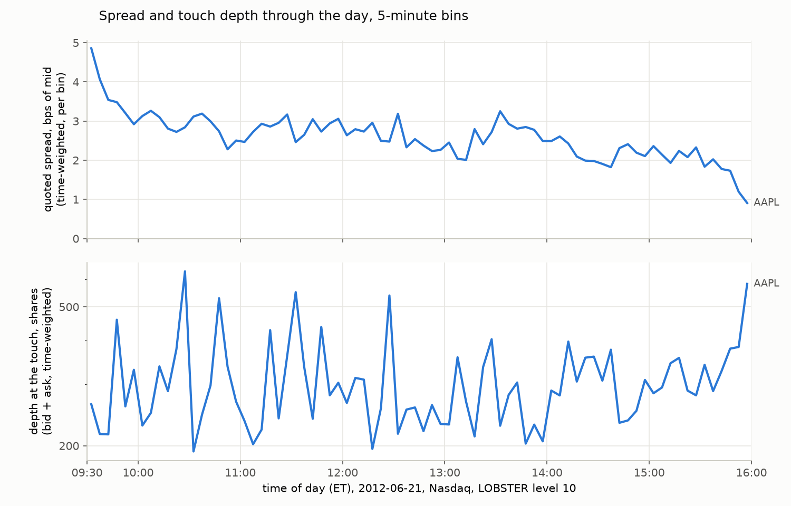
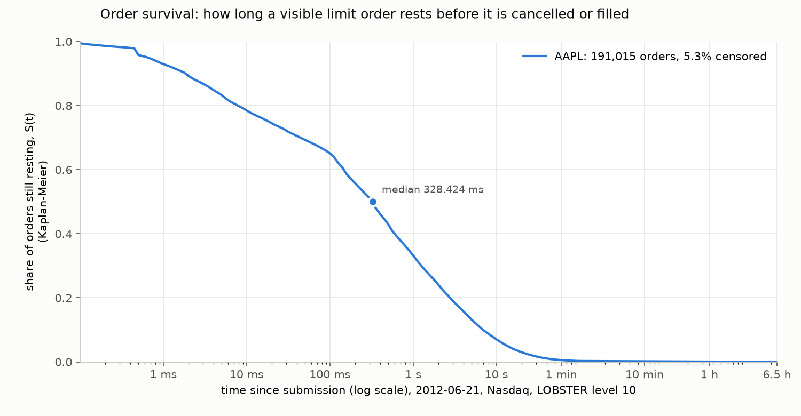
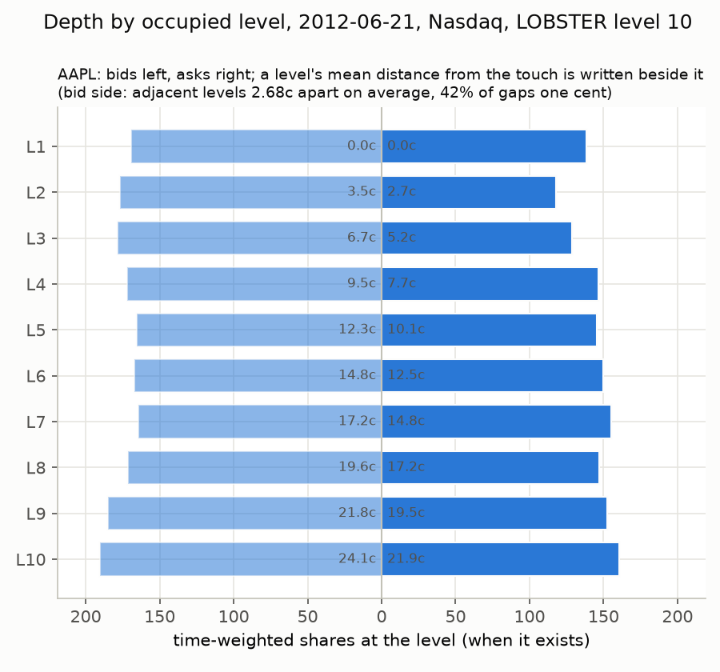
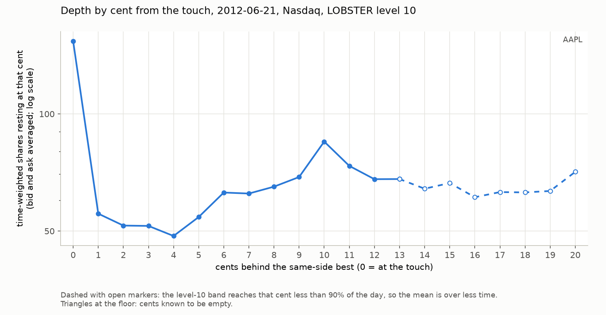

# What the book looks like: AAPL on 2012-06-21, 23 September 2026

Week 4's measurements: the first time this project looks at a book
instead of verifying one. One name so far, AAPL from LOBSTER's free
level-10 sample (Nasdaq, 9:30 to 16:00, 400,391 messages); the second
name, MSFT, slots into every table and figure below by running the same
scripts with `--ticker MSFT` once its files are on disk, and the regime
contrast the week was built around is not made until it does.

Reproduce (the LOBSTER files are gitignored; `results/lobster_validation.md`
names them):

```
python scripts/intraday_report.py --ticker AAPL && python scripts/intraday_report.py --figure --tickers AAPL
python scripts/lifecycle_report.py --ticker AAPL && python scripts/lifecycle_report.py --figure --tickers AAPL
python scripts/depth_profile.py --ticker AAPL   && python scripts/depth_profile.py --figure --tickers AAPL
python scripts/microstructure_checks.py --ticker AAPL --write results/microstructure.md
```

## Which book, and how averaged

Statistics of the book come from LOBSTER's reference rows, which are
exact for the top ten levels; statistics of orders come from the
message file, the only place order identity lives; our own replayed
book is measured against the reference in check 2 below, to learn the
error it would carry on data with no answer key. Every book statistic
is time-weighted: row *i* of the orderbook file is the book from
message *i* until message *i+1*, the last row holds until 16:00, and
each average is a sum of value times holding time over the sum of
holding times, in integer nanoseconds, divided once at the end. Only
messages and shares are counted per event. A "tick" in this code base
is the price unit, $0.0001; the exchange's $0.01 increment is called a
cent throughout, and every spread is in cents or basis points.

## Expected, written before the run

The Day 4 guide's list, graded. Each line was written before any
script ran on the data.

1. AAPL time-weighted spread between 5 and 20 cents (1 to 3 bps); at
   one cent under 10% of the time. **Held**: 15.13 cents, 2.59 bps,
   one cent 0.1% of the day.
2. Widest in the first fifteen minutes, at least twice the midday
   level; flat from late morning; a small rise in the final minutes at
   most. **Half held**: the first five minutes were 28.5 cents against
   15.7 at midday, 1.8x rather than 2x, and there is no rise at the
   close. The spread falls all day, to 5.25 cents (0.91 bps) in the
   last five minutes, a third of midday. The shape is a decline, not a
   U.
3. Volume U-shaped in five-minute bins, largest at the open and the
   close; touch depth low at the open and rising through the day.
   **Half held**: volume is J-shaped (89k shares in the first bin, 15k
   per midday bin, 173k in the last, hidden executions included), and
   the close dominates the open. Touch depth rises only gently, from
   321 shares in the first hour to 345 in the last, then jumps to 582
   in the final five minutes.
4. Cancel-to-trade by messages between 5 and 50; ours lower than
   MIDAS's. **Held on the first half**: 4.98 on the day, 5.04 on
   MIDAS's 9:35 to 16:00 window, at the bottom of the range. The MIDAS
   half is pending the download (check 3).
5. Nasdaq volume over MIDAS all-venue volume roughly 25 to 35%.
   **Pending** (check 3).
6. Lifetimes heavy-tailed, a median of seconds for observed deaths, a
   visible mass under 100 ms, a censored fraction of 1 to 10%. **Two of
   three held**: 35% of observed deaths are under 100 ms and 5.3% of
   visible orders are censored, but the median is a third of a second,
   not seconds: 290 ms for orders that die by cancellation, 1.33 s for
   orders that die by execution, 328 ms by Kaplan-Meier over both.
7. Fill rate by distance at submission: orders improving or joining the
   best fill many times more often than orders behind; beyond five
   cents behind, close to zero. **Held in shape, wrong at the tail**:
   24.7% of shares for orders that improved the best, 22.5% at the
   best, 11.7% one cent behind, 6.5% at two to five cents, and 2.3% to
   2.8% beyond, which is small but not close to zero.
8. Depth by occupied level: for AAPL a hump a few levels in and gaps
   wider than one cent. **Half held**: the gaps are wide (2.7 and 2.4
   cents between adjacent occupied levels, bid and ask), but there is
   no hump. By rank the profile is flat to slightly rising, 140 to 190
   shares at every one of the ten levels; by cent the largest queue is
   at the touch. The MSFT half of this line is pending.

<!-- tables:begin -->
### Headline table

| statistic | AAPL | definition |
|---|---|---|
| messages (level-10 file) | 400,391 | rows in the message file, 9:30 to 16:00 |
| quoted spread, cents | 15.13 | time-weighted, two-sided states |
| quoted spread, bps of mid | 2.59 | time-weighted spread over time-weighted mid |
| spread at one cent | 0.1% | share of two-sided time |
| depth at the touch, shares | 308 | best bid size plus best ask size, time-weighted |
| depth in ten levels, shares | 3,183 | both sides, time-weighted |
| executions | 34,990 | types 4 and 5 |
| volume, shares | 2,850,140 | types 4 and 5, Nasdaq only |
| hidden share of executions | 32.4% | type 5 over types 4 and 5 |
| cancel-to-trade, by messages | 4.98 | (types 2 + 3) / (types 4 + 5) |
| cancel-to-trade, by orders | 10.33 | adds ending cancelled / adds ending executed |
| cancel-to-trade, by shares | 9.11 | shares cancelled / shares executed |
| visible orders added | 191,015 | type-1 messages |
| orders ending executed | 8.4% | share of adds |
| orders censored | 5.3% | no observed end: alive at close or died below the band |
| lifetime median, ms | 328 | Kaplan-Meier |
| still resting after 10 s | 7.1% | Kaplan-Meier S(10 s) |
| fill rate, joined the best | 22.5% | shares executed / shares added |
| fill rate, 2 to 5 cents behind | 6.5% | shares executed / shares added |
| odd-lot share of executions | 53.9% | executions under 100 shares |
| adjacent-level gap, bid / ask, cents | 2.68 / 2.43 | mean cents between consecutive occupied levels |
| level 10 from the touch, bid / ask, cents | 24.1 / 21.9 | mean distance of the tenth occupied level |

### The named windows

| name | window | spread c | spread bps | one cent | touch sh | visible trades | visible volume |
|---|---|---|---|---|---|---|---|
| AAPL | first five minutes | 28.47 | 4.86 | 0.0% | 263 | 608 | 45,467 |
| AAPL | 11:00 to 14:00 | 15.66 | 2.68 | 0.0% | 289 | 7,161 | 545,125 |
| AAPL | last five minutes | 5.25 | 0.91 | 3.8% | 582 | 1,635 | 129,240 |

### Check 1, AAPL: level-1 and level-10 files, common window

| integer sum | level-1 file (118,497 msgs) | level-10 file (400,391 msgs) | agree |
|---|---|---|---|
| two_sided_ns | 23,399,995,758,824 | 23,399,995,758,824 | same |
| spread_x_ns | 35,414,581,458,791,400 | 35,414,581,458,791,400 | same |
| mid2_x_ns | 273,072,229,769,220,956,800 | 273,072,229,769,220,956,800 | same |
| one_cent_ns | 31,151,654,168 | 31,151,654,168 | same |
| touch_x_ns | 7,195,567,711,944,983 | 7,195,567,711,944,983 | same |
| trades | 23,658 | 23,658 | same |
| trade_shares | 1,845,964 | 1,845,964 | same |

Verdict: identical.

### Check 2, AAPL: the replay's error budget (level 10)

| statistic | reference | our replay | relative | predicted sign | result |
|---|---|---|---|---|---|
| spread, cents | 15.134 | 14.515 | -4.09% | lower or equal | held |
| one-cent share | 0.001 | 0.004 | +164.78% | none |  |
| touch depth, shares | 307.503 | 285.848 | -7.04% | higher | FLIPPED |
| depth-5, shares | 1,538.510 | 1,350.013 | -12.25% | higher | FLIPPED |
| depth-10, shares | 3,182.510 | 2,604.223 | -18.17% | higher | FLIPPED |
| bid level-10 distance, cents | 24.132 | 24.449 | +1.31% | none |  |
| bid adjacent gap, cents | 2.681 | 2.722 | +1.51% | none |  |
| ask level-10 distance, cents | 21.866 | 21.838 | -0.13% | none |  |
| ask adjacent gap, cents | 2.430 | 2.440 | +0.41% | none |  |

Day 2 machinery on this run: 11,351 dark ops, 12,014 evictions removing 873,292 shares over the day, 0 anomalies, 0 delete-size disagreements.

The depth error decomposed, in time-weighted shares: surplus is what we hold and the reference does not, deficit is what the reference holds and we do not.

| statistic | reference | surplus | deficit | net | net, relative |
|---|---|---|---|---|---|
| touch depth | 307.5 | 11.3 | 33.0 | -21.7 | -7.0% |
| depth-10 | 3,182.5 | 88.0 | 666.3 | -578.3 | -18.2% |

### Check 3, AAPL: SEC MIDAS, same name, same day, 9:35 to 16:00

MIDAS file not on disk; pending. Download `individual_security_2012_q2.zip` from the SEC's Market Structure Data page into `data/midas/`, unzip, and rerun `python scripts/microstructure_checks.py --ticker AAPL --write results/microstructure.md`.

<!-- tables:end -->

## The intraday shape



The spread starts at 4.86 bps in the first five minutes and is under 3
bps by ten o'clock; it drifts down through the afternoon and collapses
into the close, 0.91 bps in the last five minutes, when the touch is
also at its deepest. That last bin is where 3.8% of the two-sided time
sits at exactly one cent, against 0.1% for the day: the closing
auction's approach makes a small-tick stock briefly behave like a
large-tick one. The classic U is a U in volume, not in this day's
spread, and even the volume is lopsided toward the close.

## Order lifecycles



Of 191,015 visible orders added, 8.4% ended by execution, 86.4% by
cancellation, and 5.3% were never seen again: alive at the close or
dead below the band, which a level-10 file cannot distinguish. The
survival curve treats those as right-censored, alive at least until
their last message, and the naive statistics over observed deaths sit
beside it in `lifecycle_AAPL.csv`. Two thirds of orders are gone within
a second; 7% survive ten seconds; one in two hundred survives a minute.
There is a visible step at about half a millisecond, S(t) dropping from
0.98 to 0.96 between 0.45 ms and 0.5 ms, an add and its cancel inside
one round trip.

Where an order rests decides whether it trades. Orders that improved
the best got 24.7% of their shares filled; orders that joined the best
22.5%; one cent behind 11.7%; two to five cents behind 6.5%; six cents
and beyond, under 3%. Only 29% of adds are placed at or better than the
touch, so most of the day's quoting happens at prices that almost never
trade. Round lots are 69% of adds and odd lots 31%, yet 54% of
executions are odd lots, which is what a $585 stock does to a 100-share
convention.

Cancel-to-trade is three numbers on the same day: 4.98 by messages,
10.33 by orders, 9.11 by shares. The message version is the SEC's
definition and the one check 3 compares; it is the smallest of the
three because a resting order is usually cancelled once but executed in
several pieces.

## Book shape





All ten occupied levels exist every second of the day, and by rank
they look alike: 140 to 190 shares each, no hump. What varies is where
they are. Adjacent occupied levels average 2.7 cents apart on the bid
side and 2.4 on the ask, under half of the gaps are a single cent, and
the tenth level sits 24 and 22 cents from the touch. By cent, the
picture is the one a sparse book should give: about 150 shares at the
touch, 50 to 60 at each of the next few cents once their empty time is
counted, and a bump at exactly ten cents behind the best (89 and 81
shares against about 65 either side), which reads as round-number
placement a dime back. The level-10 band reaches the twentieth cent
only 55% of the day, so the profile beyond twelve cents is drawn
dashed and read as conditional on visibility.

## The checks

Check 1 is a known answer by construction and it held to the integer:
seven sums, from 23,399,995,758,824 nanoseconds of two-sided time to
1,845,964 visible shares traded, identical from the 118,497-message
level-1 file and the 400,391-message level-10 file. The same identity
is pinned on fiction in `tests/test_micro_checks.py`, where the Week 3
self-filter emits level-1 and level-10 views of one synthetic day.

Check 2 is the week's finding. Our replayed book, the Day 2 machinery
applied unchanged, gets the spread right to 4% (14.5 cents against
15.1, narrower as predicted) and the level geometry right to 1.5%
(adjacent gaps and level-10 distances), but its depth is LOW: 7% at the
touch, 12% over five levels, 18% over ten. The prediction, made from
Day 2's row taxonomy, said our depth would be high, because STALE rows
(we hold a level the reference says is gone) outnumber BACKFILL rows
three to one. The decomposition in the table says why that was wrong:
in time-weighted shares over ten levels we hold 88 the reference lacks
and lack 666 the reference holds. Rows are not shares. A stale level is
typically a small remnant; the liquidity we never see is large, and the
repair rules, which evicted 12,014 orders over the day, remove real
liquidity as well as phantoms. So on data with no answer key, a
level-filtered replay's depth should be read as a lower bound by
roughly a fifth at ten levels, and its spread as right to a few
percent.

Check 3 is pending the MIDAS download; the table above says exactly
what to fetch and where to put it. The predicted relations stand as
written in the guide and in `lob/checks.py`: our cancel-to-trade lower,
our trade-to-order volume higher, our volume a Nasdaq-sized share of
the whole, odd-lot and hidden rates close.

## Limitations

One name, one day, one venue, ten levels. The regime contrast (small
tick against large tick) is a design of two names and is unmade until
MSFT runs. Everything about orders is right-censored by the level-10
filter and says so; the fill rates by distance count only orders whose
add was in view. The depth profile beyond the band is unknown, not
zero, and is drawn as such. Check 2's error budget is for this file's
filter at this depth on this name; on a dense large-tick book the
filter hides less and the budget should shrink, which is one more thing
MSFT will show. The expectations list is kept above with its misses,
because the misses are the part that taught something.
